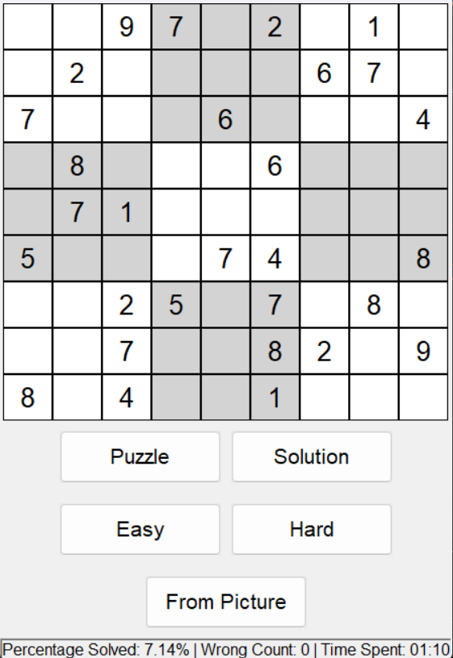

<h1 align="center">Computer Vision Sudoku Solver</h1>

## About
Utilizing computer vision to get Sudoku puzzles from pictures.

<div style="display: flex; flex-wrap: wrap;">
    
    
    
    
    
</div>


## Structure

* All other code can be found in [/models](models)
 
  * [/digit_classifier.ipynb](models/digit_classifier.ipynb): contains the code to create and train the DNN to classify digits. For this, the MNIST dataset was utilized.

  * [/solve.ipynb](models/solve.ipynb): contains code to train a DNN and an analysis on time and accuracy.

* All other code can be found in [/src](src):

  * [/camera.py](src/camera.py): Opens the camera and returns the last frame.

  * [/extract_puzzle.py](src/extract_puzzle.py): find the puzzle, classifies every digit with the DNN, and display the solution in bird view from the Sudoku obtained from the image. 

  * [/generate.py](src/generate.py): generates easy or hard Sudoku puzzles with a unique solution.

  * [get_data.py](src/get_data.py): saves generated puzzles in CSV format.

  * [gui.py](src/gui.py): makes the GUI where you can solve Sudoku's.

  * [test.py](src/test.py): contains code that checks a Sudoku's validity and unique solvability.


## Getting started
### Requirements

Install the dependencies with the following command:

```

pip install -r requirements.txt

```

Python 3.11.4 was used.

### Usage
Run the following command to open the GUI:

```

python main.py

```

### Todos

- Find smaller (faster) NN to solve Sudoku's with high accuracy

## License
MIT
