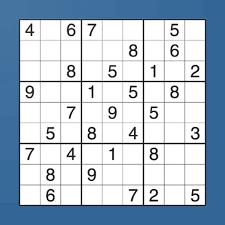
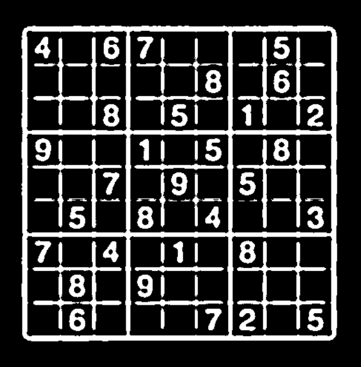
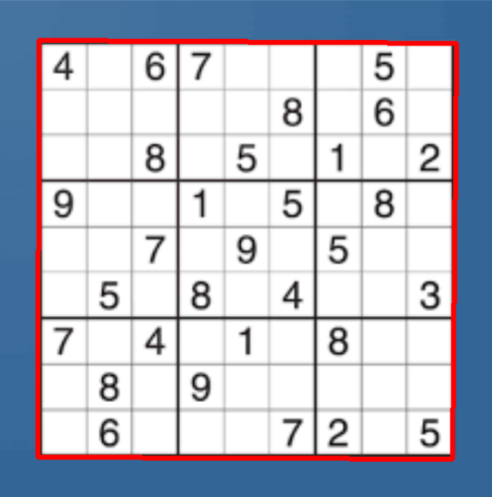
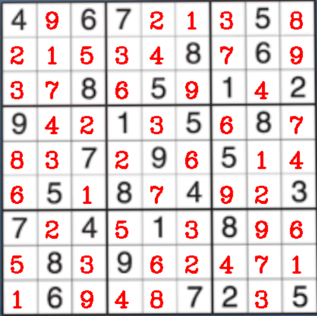

<h1 align="center">Computer Vision Sudoku Solver</h1>

## TODO

- Train NN to solve puzzles --> determine the accuracy

- GUI from image as well

## About
Utilizing computer vision to get Sudoku puzzles from images/pictures.









## Structure

* All other code can be found in [/models](models)
 
  * [/digit_classifier.ipynb](models/digit_classifier.ipynb): contains the code to create and train the DNN to classify digits. For this the MNIST dataset was utilized.

  * [/solve.ipynb](models/solve.ipynb): TODO: will contain code to create a DNN that can solve Sudoku's.

* All other code can be found in [/src](src):

  * [/camera.py](src/camera.py): Opens the camera and returns the last frame.

  * [/extract_puzzle.py](src/extract_puzzle.py): find the puzzle, classifies every digit with the DNN, and displays the solution in the birdview from the Sudoku obtained from the image. 

  * [/generate.py](src/generate.py): generates easy or difficult Sudoku puzzles with a unique solution.

  * [get_data.py](src/get_data.py): saves generated puzzles in JSON format.

  * [gui.py](src/gui.py): makes the GUI where you can solve Sudoku's.

  * [test.py](src/test.py): contains code that checks the validity and unique solvability of a Sudoku.


## Getting started
### Requirements

Install the dependencies with the following command:

```

pip install -r requirements.txt

```

Python 3.10.6 was used.

### Usage
Run the following command to open the GUI:

```

python main.py

```

## License
MIT